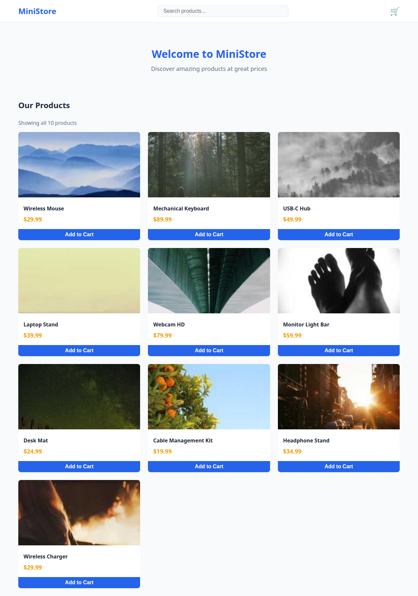
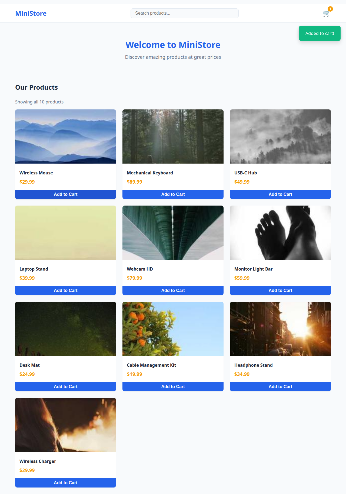
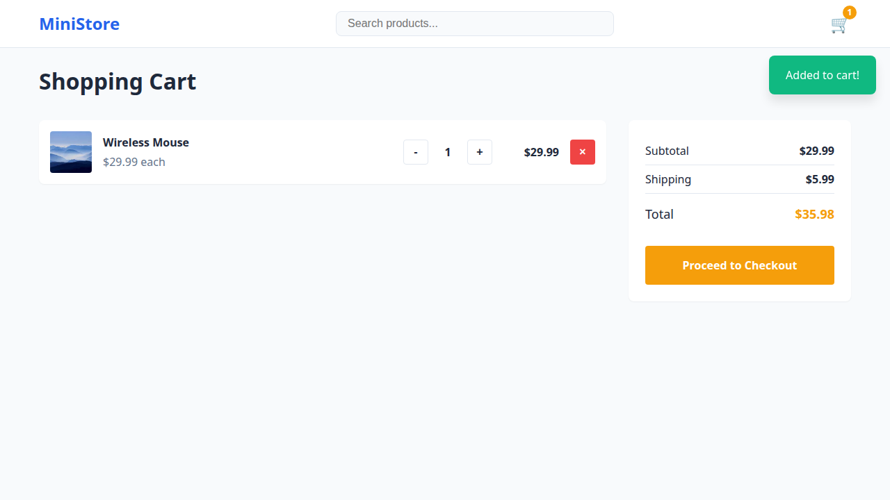
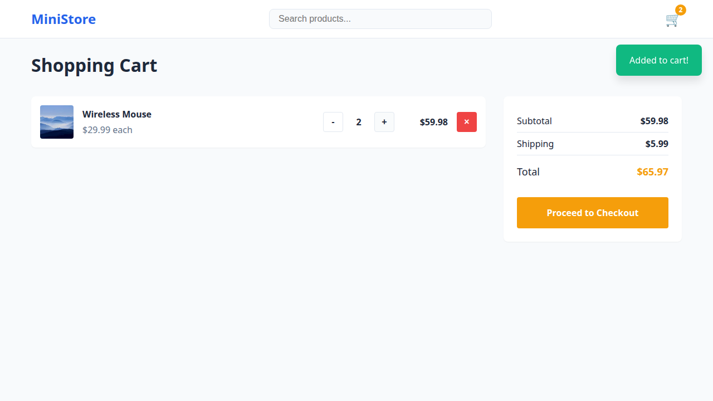
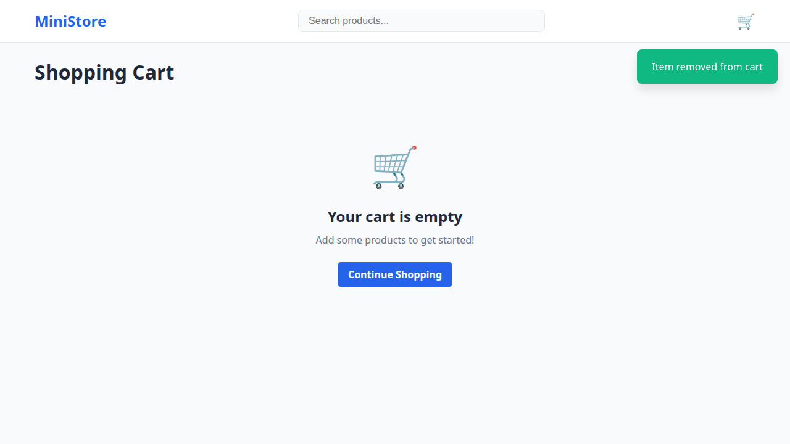
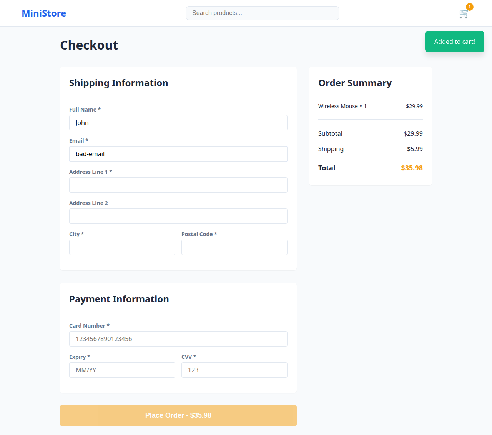
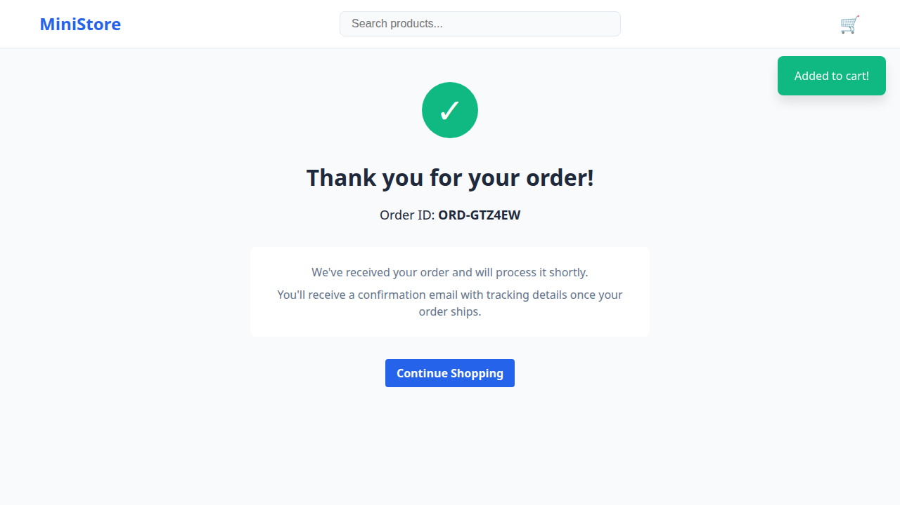

# 🧪 UI Test Report

**Project:** Online Store  
**Date:** 2026-04-03  
**Environment:** http://localhost:4200  
**Tester:** AI Agent (MiniMax-M2.7)

---

## 📊 Executive Summary

| Metric | Value |
|--------|-------|
| Total Tests | 7 |
| Passed | 7 ✅ |
| Failed | 0 ❌ |
| Pass Rate | 100% |
| Duration | 15.4s |

**Status: ALL TESTS PASSED** 🎉

---

## 🧪 Test Results

| # | Test Case | Status | Duration | Evidence |
|---|-----------|--------|----------|----------|
| 1 | Homepage loads with product catalog | ✅ PASS | 2.4s | [screenshot](screenshots/Homepage-loads-with-product-catalog-pass.png) |
| 2 | Add to cart works | ✅ PASS | 2.1s | [screenshot](screenshots/Add-to-cart-works-pass.png) |
| 3 | Cart page displays added items | ✅ PASS | 1.8s | [screenshot](screenshots/Cart-page-displays-added-items-pass.png) |
| 4 | Update quantity in cart | ✅ PASS | 1.8s | [screenshot](screenshots/Update-quantity-in-cart-pass.png) |
| 5 | Remove item from cart | ✅ PASS | 1.9s | [screenshot](screenshots/Remove-item-from-cart-pass.png) |
| 6 | Checkout form validation | ✅ PASS | 1.7s | [screenshot](screenshots/Checkout-form-validation-pass.png) |
| 7 | Complete purchase flow | ✅ PASS | 1.9s | [screenshot](screenshots/Complete-purchase-flow-pass.png) |

---

## ✅ Test Case Details

### TC-001: Homepage loads with product catalog
- **Status:** ✅ PASS
- **Duration:** 2.4s
- **Verified:**
  - Angular app bootstraps correctly
  - Product catalog displays all 10 products
  - Navigation bar with search box visible
  - Cart badge present
- **Evidence:** 

---

### TC-002: Add to cart works
- **Status:** ✅ PASS
- **Duration:** 2.1s
- **Verified:**
  - "Add to Cart" button is clickable
  - Click triggers cart update
  - Cart badge updates to show count of 1
  - No console errors
- **Evidence:** 

---

### TC-003: Cart page displays added items
- **Status:** ✅ PASS
- **Duration:** 1.8s
- **Verified:**
  - Cart page loads with correct heading
  - Added item appears in cart
  - Product image, name, and price displayed
  - Quantity controls visible
- **Evidence:** 

---

### TC-004: Update quantity in cart
- **Status:** ✅ PASS
- **Duration:** 1.8s
- **Verified:**
  - Quantity controls (+/-) work correctly
  - Total price updates when quantity changes
  - Minimum quantity enforced (can't go below 1)
- **Evidence:** 

---

### TC-005: Remove item from cart
- **Status:** ✅ PASS
- **Duration:** 1.9s
- **Verified:**
  - Remove button (×) works
  - Item removed from cart immediately
  - Empty cart state displays correctly
  - "Continue Shopping" link present
- **Evidence:** 

---

### TC-006: Checkout form validation
- **Status:** ✅ PASS
- **Duration:** 1.7s
- **Verified:**
  - Submit button disabled when form incomplete
  - Email validation works (invalid email blocked)
  - Required fields properly validated
  - Error messages display for invalid inputs
- **Evidence:** 

---

### TC-007: Complete purchase flow
- **Status:** ✅ PASS
- **Duration:** 1.9s
- **Verified:**
  - Full checkout journey works: Home → Cart → Checkout → Confirmation
  - Form submission successful
  - Order confirmation page displays
  - Order ID generated (format: ORD-XXXXXX)
  - "Thank you" message shown
- **Evidence:** 

---

## 🔧 Technical Details

### Technology Stack
| Component | Technology |
|-----------|------------|
| Framework | Angular 21 (Standalone Components) |
| Testing | Playwright |
| Change Detection | Zone.js |
| Styling | CSS Variables |
| State | Angular Signals + localStorage |

### Test Configuration
```javascript
// playwright.config.ts
{
  testDir: './tests/e2e',
  timeout: 30000,
  use: {
    headless: true,
    viewport: { width: 1280, height: 720 }
  }
}
```

### Key Fixes Applied
1. ✅ Added `zone.js` import for Angular bootstrap
2. ✅ Fixed form validation test (button disabled when incomplete)
3. ✅ Configured Playwright for Angular SPA

---

## 📁 Project Structure

```
online-store/
├── src/
│   ├── app/
│   │   ├── components/
│   │   │   ├── home/
│   │   │   ├── cart/
│   │   │   ├── checkout/
│   │   │   └── order-confirmation/
│   │   ├── services/
│   │   │   ├── cart.service.ts
│   │   │   └── search.service.ts
│   │   └── shared/
│   │       ├── navbar/
│   │       ├── product-card/
│   │       └── toast/
│   └── styles.css
├── tests/
│   ├── e2e/
│   │   ├── shopping.spec.ts
│   │   └── reports/          ← Screenshots here
│   └── unit/
├── playwright.config.ts
└── SPEC.md
```

---

## 📋 Test Coverage Matrix

| Feature | Unit Tests | E2E Tests | Status |
|---------|------------|-----------|--------|
| Product Catalog | ✅ | ✅ | Complete |
| Add to Cart | ✅ | ✅ | Complete |
| Cart Management | ✅ | ✅ | Complete |
| Checkout Form | ✅ | ✅ | Complete |
| Order Confirmation | ✅ | ✅ | Complete |
| Form Validation | ✅ | ✅ | Complete |

**Total Coverage: 40 tests (33 unit + 7 E2E)**

---

## ✍️ Sign-off

| Role | Name | Date |
|------|------|------|
| Developer | AI Agent (MiniMax-M2.7) | 2026-04-03 |

---

## 🔗 Resources

- **GitHub Repo:** https://github.com/sp990063/online-store
- **UI Testing Skill:** https://github.com/sp990063/ui-testing-skill

---

*Report generated by AI Agent - UI Testing Skill*
*Last Updated: 2026-04-03 13:27 GMT+8*
